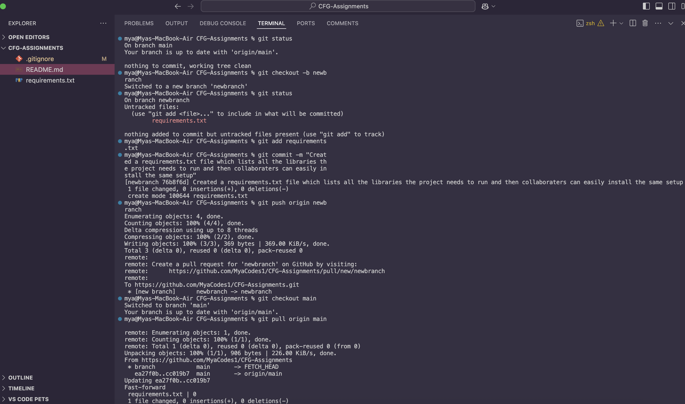
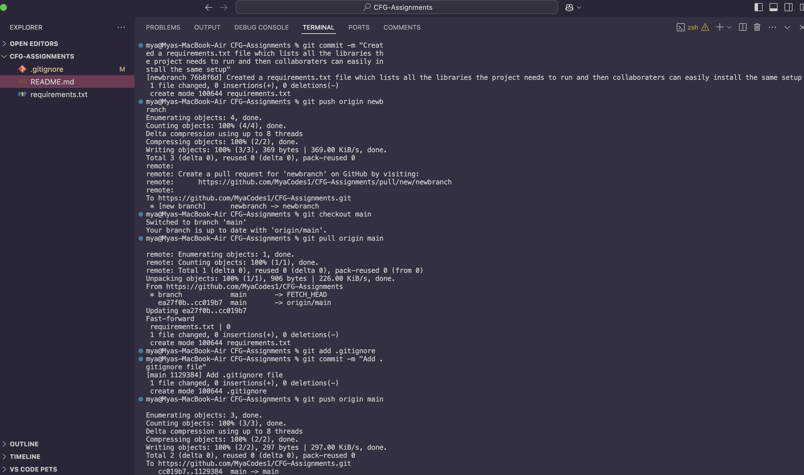

# CFG-Assignments

## This README file will discuss how I will be using GitHub during this assignment.

I am going to use different markdown text formatting features, demonstrate different **Git** commands such as
creating a branch, adding files to a branch and opening a pull request.
_Lastly,_ I will create a <ins> .gitignore </ins> and requirements.txt file.

An example of using Subscript text feature.

## Git Commands demonstration

I created a new branch called 'newbranch' using the Git command: git checkout -b newbranch
This would allow me to make changes separately from the main branch.

I also created as new file called 'requirements.txt' and added it to my branch. Git commands used:
'git add requirements.txt' and 'git commit -m "created requirements.txt file'
Demonstrating how files can be added and tracked in a branch.

I pushed my new branch to GitHub using: git push origin newbranch
A link was provided to create a pull request instead of having to enter more commands which I then used to request merging my changes into the main branch.

I merged it into the main branch on GitHub and then updated my local repository using: 'git checkout main' and 'git pull origin main'
This ensured my local project matched the updated main branch

The requirements.txt file is used to list all the libraries or dependencies a project needs to run, which helps other users install the same setup easily.

Lastly, the .gitgnore file tells Git which files or folders should or shouldn't be tracked which helps avoid adding unecessary files to the repo.

##DEMONSTRATIONS

